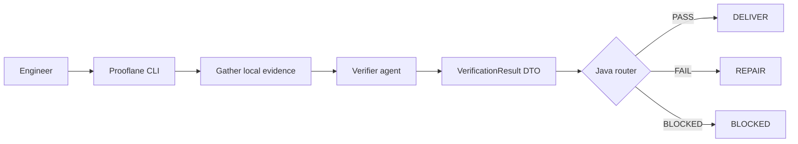
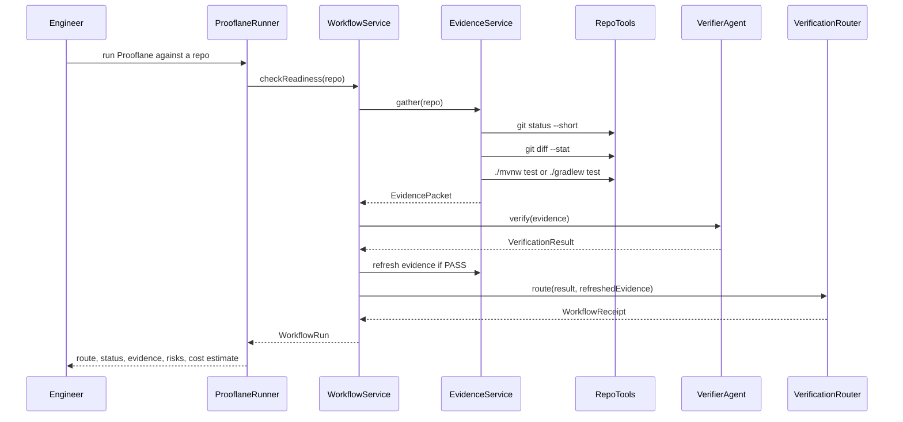
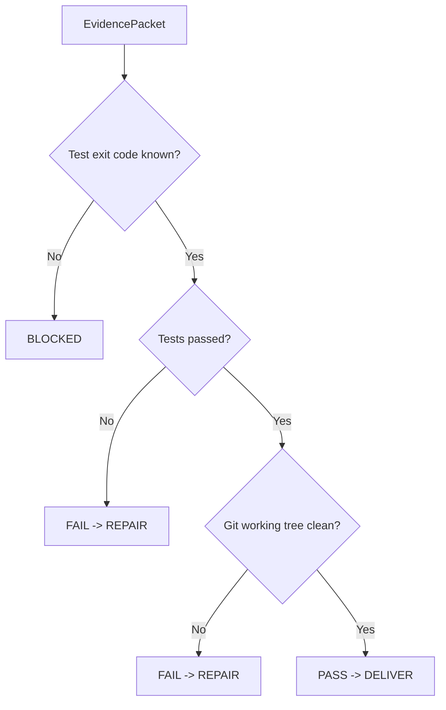
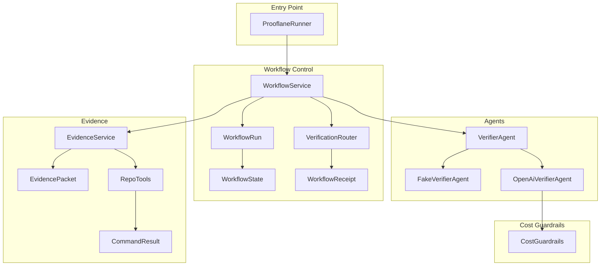
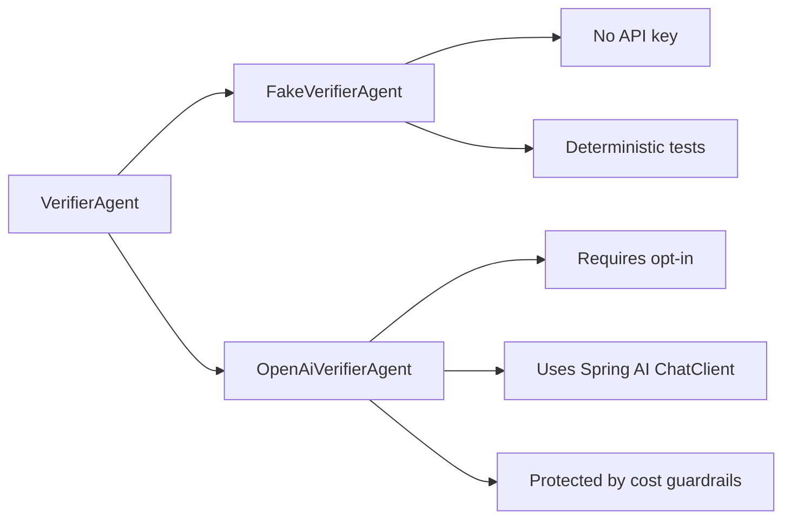
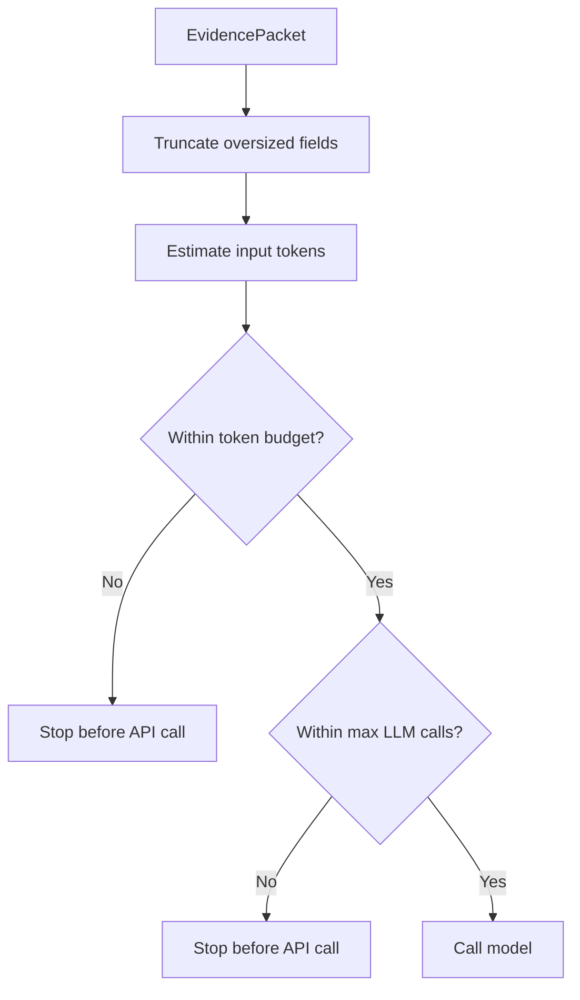

# Prooflane

> A Java-flavored learning project for boring, explicit agentic workflows.

Prooflane is a small Spring AI learning project for evidence-driven agentic
workflows. It is intentionally boring: ordinary Java services, DTOs, tests, and
routers first; model calls only where they add judgment over evidence.

It teaches one core idea:

```text
LLMs can reason over evidence.
Java should own workflow state, routing, budgets, and safety.
```

The first use case is a local PR-readiness check. You point Prooflane at a
repository, it gathers evidence, a verifier returns a typed judgment, and Java
routes the result to delivery, repair, or blocked.

## The Big Picture



The important boundary is between the verifier and the router:

```text
The verifier may judge the evidence.
The router decides the next workflow state.
```

That keeps the workflow inspectable and testable.

## What Happens In One Run



## Current Readiness Rules

Fake mode is the default. It makes readiness decisions with simple Java rules:



Today, a repo is considered ready only when:

```text
tests pass
and
git status --short is empty
```

This is intentionally small. Later phases can add GitHub PR state, review
state, CI status, branch freshness, security-sensitive paths, and richer evals.

## Class Map



Read it like this:

```text
ProoflaneRunner is the CLI adapter.
WorkflowService owns the run.
EvidenceService gathers compact evidence.
VerifierAgent returns a typed judgment.
VerificationRouter owns the next route.
WorkflowRun records what happened.
```

## Fake Mode And Real LLM Mode

Prooflane has two verifier implementations:



Fake mode is best for learning, tests, and workflow design.

Real OpenAI mode is best when you want the model to interpret messy evidence,
summarize risks, or produce a more useful next step.

## Cost Guardrails

Prooflane is designed so real model calls are explicit and bounded.



Defaults:

```properties
prooflane.agent.mode=fake
prooflane.guardrails.max-evidence-chars=12000
prooflane.guardrails.max-llm-calls=1
prooflane.guardrails.estimated-input-token-budget=4000
prooflane.guardrails.estimated-output-token-budget=800
```

Tests do not call paid APIs.

## Run It

Run tests:

```bash
./mvnw test
```

Run fake mode against a repository:

```bash
./mvnw spring-boot:run -Dspring-boot.run.arguments=/path/to/repo
```

Run fake mode against this repository:

```bash
./mvnw spring-boot:run -Dspring-boot.run.arguments=.
```

Run real OpenAI mode:

```bash
export OPENAI_API_KEY=...
export PROOFLANE_AGENT_MODE=openai
export PROOFLANE_SPRING_AI_MODEL=openai
./mvnw spring-boot:run -Dspring-boot.run.arguments=/path/to/repo
```

## Example Output

```text
Prooflane run: 9f8a7c6b-1234-4567-89ab-123456789abc
Prooflane route: DELIVER
Workflow state: DELIVERED
Status: PASS
Evidence: [tests passed, working tree is clean]
Risks: []
Next step: Ready for delivery refresh.
Configured max GPT-5 Mini call cost: $0.0026
```

## The Learning Principle

Prooflane is built around one simple principle:

```text
Agent nodes do judgment-heavy work.
Workflow code enforces state, routing, and completion rules.
```

The first version is deliberately small:

```text
No multi-agent fan-out yet.
No GitHub PR mutation yet.
No persistent graph runtime yet.
No autonomous issue selection yet.
```

That is the point. The project starts with one understandable workflow, then
adds agentic capabilities one phase at a time.

## License

MIT License. See [LICENSE](LICENSE).
